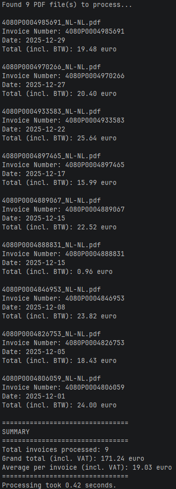

# Teqit.TeslaInvoices – Tesla PDF invoice parser for .NET

[](https://dotnet.microsoft.com)
[](https://opensource.org/licenses/MIT)

A fast console tool that extracts **total amounts** (incl. VAT) from batches of Tesla PDF invoices (Dutch & German formats tested).

## Features

- Processes hundreds of invoices in seconds (parallel processing)
- Supports unpacked Tesla invoice ZIPs
- Clean summary with grand total + average
- Cross-platform (.NET 10)
- MIT Licensed

## Usage

Run the tool by passing the directory in which the invoices are located (default downloaded Tesla .ZIP file or unpacked .PDF files):

### Windows

```powershell
.\Teqit.TeslaInvoices.exe "C:\temp\MAY_2025-JUN_2025.ZIP"
```
```powershell
.\Teqit.TeslaInvoices.exe "C:\temp\MAY_2025-JUN_2025"
```

### Linux

```bash
./Teqit.TeslaInvoices "/home/user/invoices/MAY_2025-JUN_2025.ZIP"
```
```bash
./Teqit.TeslaInvoices "/home/user/invoices/MAY_2025-JUN_2025"
```

## Example output


